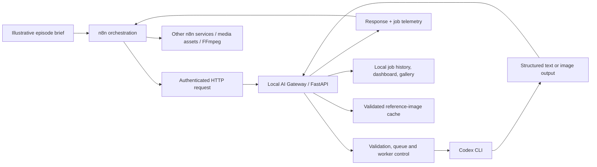
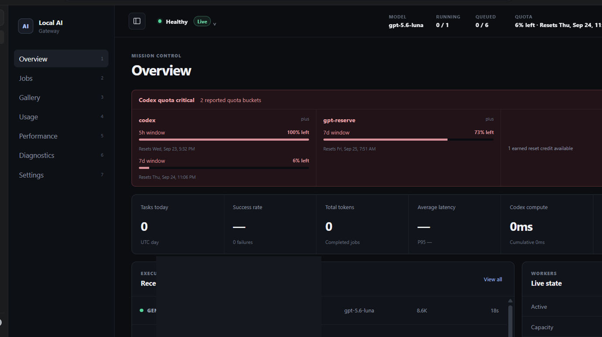
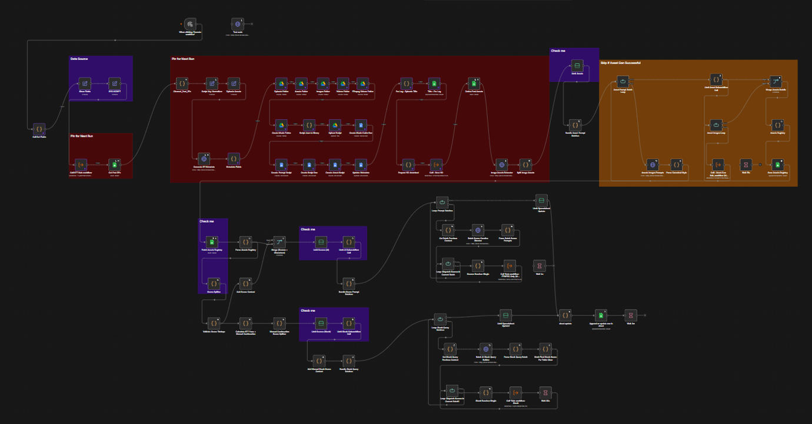
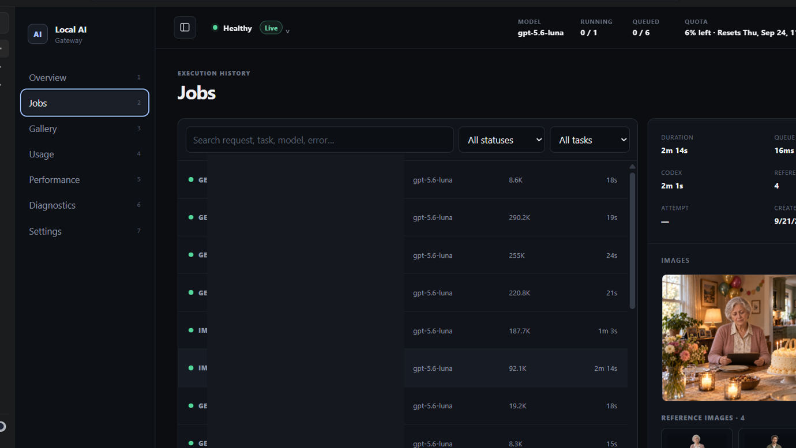
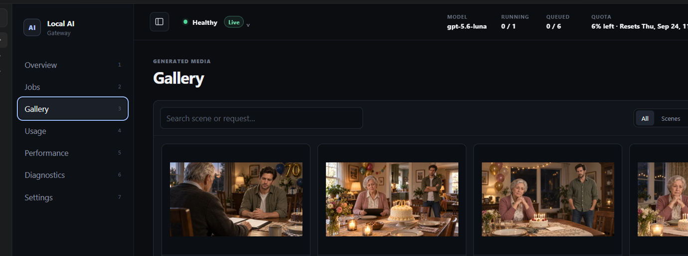
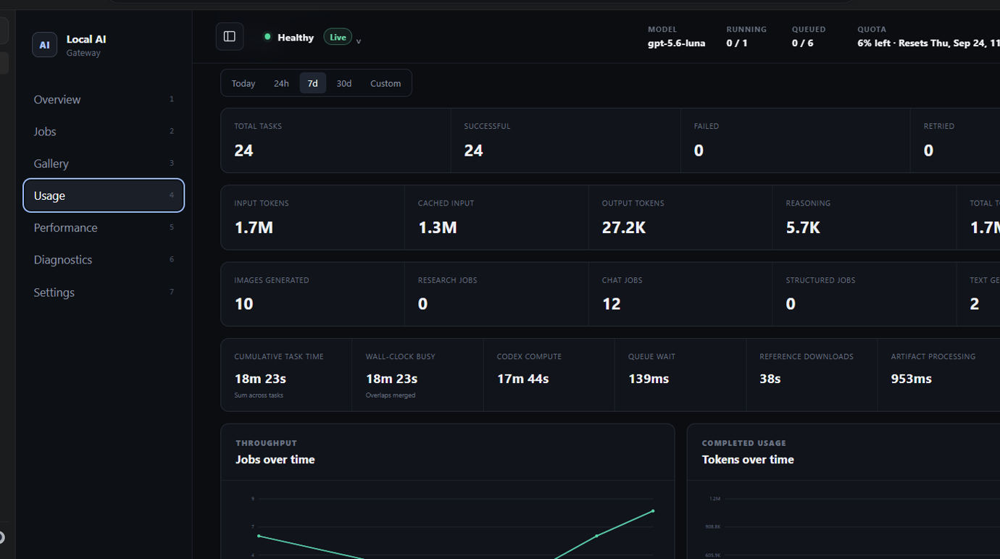

# Building a Codex-Powered Content Automation Gateway

**An engineering case study in n8n orchestration, local AI execution, reliable integrations, and media-production operations.**

## The problem

A distributed media-production operation had several repetitive, multi-step tasks: translating an episode brief into structured production metadata, planning scene and asset requirements, generating image prompts or images, and passing results to downstream render workflows. Coordinating AI services, n8n nodes, file-based outputs, and production-team expectations required more than a single prompt or API call.

I built a **Windows-hosted Python/FastAPI gateway for the Codex CLI**, integrated with **n8n**, to give the workflow a consistent, observable interface for Codex-driven tasks. n8n retains responsibility for the broader production pipeline—including other providers, stock-media retrieval, transcription, FFmpeg processing, and downstream orchestration. The gateway handles Codex requests, related reference images, execution controls, and operational visibility.

## System at a glance

This is an **architecture illustration**, not a published export of the real n8n workflow.

## My contribution

- Designed and built an authenticated API layer between n8n and a Codex CLI running under an existing local account session.
- Implemented compatibility-oriented text and structured-JSON responses so existing n8n parser patterns could be migrated incrementally.
- Added an image-generation route returning binary image data that downstream n8n HTTP nodes can handle as files.
- Built request validation, bounded worker/queue handling, timeouts, standardized errors, and execution telemetry.
- Developed a local dashboard for job state, usage, diagnostics, and managed image artifacts.
- Added reference-image validation and an opt-in cache to reduce repeat network downloads and file duplication.
- Designed optional episode-scoped persistent sessions with title-based isolation and conservative recovery when a resumed turn is interrupted. Its deployment/use is feature-gated; this case study does not imply every optional feature was enabled in the live workflow.
- Kept the full content-production orchestration in n8n instead of conflating AI execution with media rendering.

## The stack

| Layer | Technology / responsibility |
| --- | --- |
| Workflow orchestration | n8n, with task-specific nodes and downstream processing |
| Gateway | Python, FastAPI, Pydantic |
| AI execution | Locally authenticated Codex CLI |
| Text/JSON integration | HTTP routes and schema validation |
| Image outputs | Binary responses and locally managed artifact handling |
| Operational records | SQLite job metadata, progress/usage metrics and dashboard |
| Media assembly | Separate n8n-connected services and FFmpeg steps |
| Hosting | Windows local gateway; n8n may run in Docker on the same or another trusted machine |

## A safe, illustrative request

See [`examples/illustrative-requests.json`](examples/illustrative-requests.json) for invented inputs demonstrating the interface. Those are **teaching examples**, not raw production payloads. No live endpoint, token, source media URL, employer system, or actual episode information is included.

## What made this interesting technically

**1. Existing workflow compatibility.** The replacement service had to return predictable JSON so downstream parsing and validation could remain intact. Changing an integration contract is often riskier than writing its first version.

**2. A file is not JSON.** Image-generation outputs needed binary-response handling in n8n, managed artifacts for inspection, and clear separation from textual generation routes.

**3. 'The request completed' does not mean 'the production step worked.'** I added explicit execution state and failure visibility so operators can distinguish queueing, execution, validation, and artifact errors instead of debugging silent downstream failures.

**4. Reference images are both a correctness and cost-of-I/O problem.** Selected references are validated before use; an optional cache avoids repeatedly fetching identical URLs. Cache freshness and eviction are separate from output-gallery retention.

**5. Session reuse has trade-offs.** Optional episode sessions help maintain context, but can increase prompt history and cost. Interrupted resumed turns are treated conservatively; I do not claim guaranteed savings.

More detail: [Architecture](docs/architecture.md) · [Reliability and trade-offs](docs/reliability.md) · [Case study](docs/case-study.md).

## Screenshots and bounded demonstration evidence

The images below are cropped/redacted captures supplied from the author's local test environment, not a hosted demo. Internal request labels and the n8n localhost workflow address have been omitted. **Before publishing the image files, confirm the scene artwork/reference assets are yours to share or cleared for portfolio use.**

| Gateway control plane | n8n orchestration |
| --- | --- |
|  |  |

| Job details | Generated image gallery |
| --- | --- |
|  |  |

In the supplied **7-day dashboard snapshot**, the interface shows **24 recorded tasks, 24 successful, zero failed, and 10 images generated**. It also displays approximately **1.7 million total tokens** and **1.3 million cached input tokens** in that selected reporting view. These values are a **point-in-time local snapshot**, not a claimed lifetime success rate, uptime SLA, causal savings attributable to the reference-image cache, or independent verification of final rendered videos. The Overview screenshot separately shows zero tasks for its current UTC day; the reporting windows differ.

For the operating context and validation boundaries, see [Case study](docs/case-study.md) and [Reliability](docs/reliability.md).

## Evidence and scope

This write-up was prepared from the implementation's repository documentation and source architecture. It is **not** a claim that every documented feature has independently passed a fresh live test, and it is **not** an open-source release of the production gateway. The full source, real n8n workflow exports, client footage, production logs and credentials are intentionally omitted; a cropped illustration of generated scene artifacts may be provided only after rights review.

If you are evaluating this work for an automation-engineering role, the key skills illustrated are **API integration, structured-output contracts, n8n orchestration, AI/LLM execution, failure handling, developer tooling, and operations-aware system design**.

## Privacy and attribution

No client names, internal workflow IDs, private network addresses, credentials, signed asset URLs, or raw job identifiers are deliberately pulished. The supplied screenshots have been cropped and identifiers obscured; the author remains responsible for confirming that depicted media is cleared for public portfolio use. Codex is used as a local CLI tool; this case study is not an official OpenAI product or endorsement.

